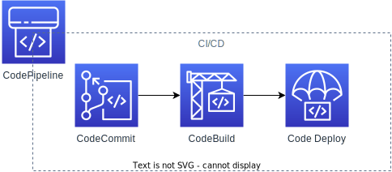
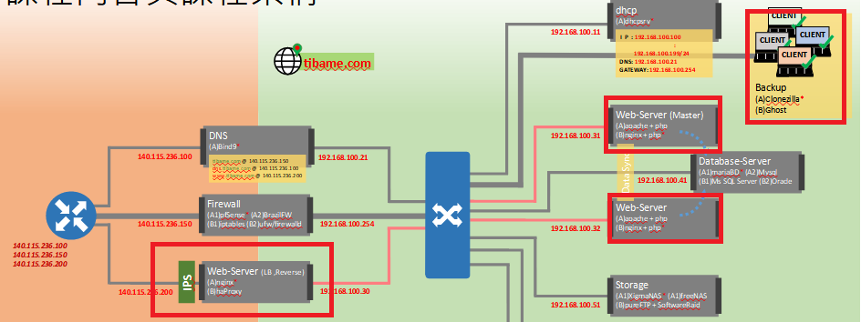

<!--
參考: https://github.com/CyC2018/Markdown-Resume

icon: https://www.svgrepo.com/

-->

# 張再富(zack)

人生三十年，與天地長久相較，如夢又似幻；一度得生者，豈有不滅者乎？

<!-- TOC -->

- [張再富zack](#%E5%BC%B5%E5%86%8D%E5%AF%8Czack)
    - [ 聯絡方式](#img-srcassetsiconsaddress-card-svgrepo-comsvg-width24px-%E8%81%AF%E7%B5%A1%E6%96%B9%E5%BC%8F)
    - [ 個人訊息](#img-srcassetsiconsinfo-circle-svgrepo-comsvg-width24px-%E5%80%8B%E4%BA%BA%E8%A8%8A%E6%81%AF)
    - [ 工作經歷-Work Experience](#img-srcassetsiconsbriefcase-svgrepo-comsvg-width24px-%E5%B7%A5%E4%BD%9C%E7%B6%93%E6%AD%B7-work-experience)
        - [緯育股份有限公司，進修，2021/12~2022/04](#%E7%B7%AF%E8%82%B2%E8%82%A1%E4%BB%BD%E6%9C%89%E9%99%90%E5%85%AC%E5%8F%B8%E9%80%B2%E4%BF%AE202112202204)
        - [云智資訊股份有限公司，JAVA工程師，2021/04~2021/10](#%E4%BA%91%E6%99%BA%E8%B3%87%E8%A8%8A%E8%82%A1%E4%BB%BD%E6%9C%89%E9%99%90%E5%85%AC%E5%8F%B8java%E5%B7%A5%E7%A8%8B%E5%B8%AB202104202110)
        - [正璽顧問有限公司，JAVA工程師，2018/11~2021/01](#%E6%AD%A3%E7%92%BD%E9%A1%A7%E5%95%8F%E6%9C%89%E9%99%90%E5%85%AC%E5%8F%B8java%E5%B7%A5%E7%A8%8B%E5%B8%AB201811202101)
        - [中華系統整合，JAVA工程師，2016/10~2018/10](#%E4%B8%AD%E8%8F%AF%E7%B3%BB%E7%B5%B1%E6%95%B4%E5%90%88java%E5%B7%A5%E7%A8%8B%E5%B8%AB201610201810)
    - [ 最高學歷 – Education](#img-srcassetsiconsgraduation-cap-svgrepo-comsvg-width24px-%E6%9C%80%E9%AB%98%E5%AD%B8%E6%AD%B7--education)
        - [大同大學，資訊工程學系，2012/09~2016/09](#%E5%A4%A7%E5%90%8C%E5%A4%A7%E5%AD%B8%E8%B3%87%E8%A8%8A%E5%B7%A5%E7%A8%8B%E5%AD%B8%E7%B3%BB201209201609)
    - [ 專案經歷-Project Experience](#img-srcassetsiconsproject-diagram-svgrepo-comsvg-width24px-%E5%B0%88%E6%A1%88%E7%B6%93%E6%AD%B7-project-experience)
        - [緯育TibaMe](#%E7%B7%AF%E8%82%B2tibame)
            - [專案名稱：雲端經典架構WordPress](#%E5%B0%88%E6%A1%88%E5%90%8D%E7%A8%B1%E9%9B%B2%E7%AB%AF%E7%B6%93%E5%85%B8%E6%9E%B6%E6%A7%8Bwordpress)
            - [專案名稱：k8s 容器管理](#%E5%B0%88%E6%A1%88%E5%90%8D%E7%A8%B1k8s-%E5%AE%B9%E5%99%A8%E7%AE%A1%E7%90%86)
            - [專案名稱：Devops經典流程的實作](#%E5%B0%88%E6%A1%88%E5%90%8D%E7%A8%B1devops%E7%B6%93%E5%85%B8%E6%B5%81%E7%A8%8B%E7%9A%84%E5%AF%A6%E4%BD%9C)
            - [專案名稱：私有雲建置](#%E5%B0%88%E6%A1%88%E5%90%8D%E7%A8%B1%E7%A7%81%E6%9C%89%E9%9B%B2%E5%BB%BA%E7%BD%AE)
            - [專案名稱：HAProxy建置](#%E5%B0%88%E6%A1%88%E5%90%8D%E7%A8%B1haproxy%E5%BB%BA%E7%BD%AE)
        - [國泰金控](#%E5%9C%8B%E6%B3%B0%E9%87%91%E6%8E%A7)
            - [專案名稱：投資平台 多租戶會員](#%E5%B0%88%E6%A1%88%E5%90%8D%E7%A8%B1%E6%8A%95%E8%B3%87%E5%B9%B3%E5%8F%B0-%E5%A4%9A%E7%A7%9F%E6%88%B6%E6%9C%83%E5%93%A1)
            - [專案名稱：智慧醫療 業務中台](#%E5%B0%88%E6%A1%88%E5%90%8D%E7%A8%B1%E6%99%BA%E6%85%A7%E9%86%AB%E7%99%82-%E6%A5%AD%E5%8B%99%E4%B8%AD%E5%8F%B0)
        - [中國人壽](#%E4%B8%AD%E5%9C%8B%E4%BA%BA%E5%A3%BD)
            - [專案名稱：數位行銷部-電子商務前台](#%E5%B0%88%E6%A1%88%E5%90%8D%E7%A8%B1%E6%95%B8%E4%BD%8D%E8%A1%8C%E9%8A%B7%E9%83%A8-%E9%9B%BB%E5%AD%90%E5%95%86%E5%8B%99%E5%89%8D%E5%8F%B0)
            - [專案名稱：數位行銷部-電子商務後台](#%E5%B0%88%E6%A1%88%E5%90%8D%E7%A8%B1%E6%95%B8%E4%BD%8D%E8%A1%8C%E9%8A%B7%E9%83%A8-%E9%9B%BB%E5%AD%90%E5%95%86%E5%8B%99%E5%BE%8C%E5%8F%B0)
        - [宏碁](#%E5%AE%8F%E7%A2%81)
            - [專案名稱：最高法院相關系統開發及維護](#%E5%B0%88%E6%A1%88%E5%90%8D%E7%A8%B1%E6%9C%80%E9%AB%98%E6%B3%95%E9%99%A2%E7%9B%B8%E9%97%9C%E7%B3%BB%E7%B5%B1%E9%96%8B%E7%99%BC%E5%8F%8A%E7%B6%AD%E8%AD%B7)
            - [專案名稱：最高法院轉檔系統維護](#%E5%B0%88%E6%A1%88%E5%90%8D%E7%A8%B1%E6%9C%80%E9%AB%98%E6%B3%95%E9%99%A2%E8%BD%89%E6%AA%94%E7%B3%BB%E7%B5%B1%E7%B6%AD%E8%AD%B7)
        - [中華電信研究院](#%E4%B8%AD%E8%8F%AF%E9%9B%BB%E4%BF%A1%E7%A0%94%E7%A9%B6%E9%99%A2)
            - [專案名稱：帳務系統出帳作業](#%E5%B0%88%E6%A1%88%E5%90%8D%E7%A8%B1%E5%B8%B3%E5%8B%99%E7%B3%BB%E7%B5%B1%E5%87%BA%E5%B8%B3%E4%BD%9C%E6%A5%AD)
            - [專案名稱：出帳作業抽產檔模組](#%E5%B0%88%E6%A1%88%E5%90%8D%E7%A8%B1%E5%87%BA%E5%B8%B3%E4%BD%9C%E6%A5%AD%E6%8A%BD%E7%94%A2%E6%AA%94%E6%A8%A1%E7%B5%84)
            - [專案名稱：帳務排程系統維護](#%E5%B0%88%E6%A1%88%E5%90%8D%E7%A8%B1%E5%B8%B3%E5%8B%99%E6%8E%92%E7%A8%8B%E7%B3%BB%E7%B5%B1%E7%B6%AD%E8%AD%B7)
            - [專案名稱：帳務系統持續性整合](#%E5%B0%88%E6%A1%88%E5%90%8D%E7%A8%B1%E5%B8%B3%E5%8B%99%E7%B3%BB%E7%B5%B1%E6%8C%81%E7%BA%8C%E6%80%A7%E6%95%B4%E5%90%88)
    - [ 技能清單-Skills](#img-srcassetsiconstools-svgrepo-comsvg-width24px-%E6%8A%80%E8%83%BD%E6%B8%85%E5%96%AE-skills)
        - [Back-end & Frameworks](#back-end--frameworks)
        - [Front-end & Frameworks](#front-end--frameworks)
        - [Databases](#databases)
        - [Servers](#servers)
        - [Operating System](#operating-system)
        - [Build Tool](#build-tool)
        - [Continuous Integration](#continuous-integration)
        - [Version Control System](#version-control-system)

<!-- /TOC -->

 ##  聯絡方式

  -  Line: zeroxzack</a>
  -  Email: rockexe0000@yahoo.com.tw
  -  Phone: 0912344343

 ##  個人訊息

  - 求職意向：DEVOPS工程師、JAVA工程師
  - 工作經驗：5 年
  - 希望地點：台北市
  - 期望薪資：100k
  - 關於未來工作的提問: <https://github.com/rockexe0000/rockexe0000/blob/main/reverse-interview.md>
    > 
  -  Github: <https://github.com/rockexe0000>
    > 

##  工作經歷-Work Experience

### 緯育股份有限公司，進修，2021/12~2022/04
### 云智資訊股份有限公司，JAVA工程師，2021/04~2021/10
### 正璽顧問有限公司，JAVA工程師，2018/11~2021/01
### 中華系統整合，JAVA工程師，2016/10~2018/10

##  最高學歷 – Education
### 大同大學，資訊工程學系，2012/09~2016/09

##  專案經歷-Project Experience

### 緯育TibaMe

#### 專案名稱：雲端經典架構(WordPress)
  - 專案內容：
    - 在AWS/GCP搭建一個Wordpress網站
  - 工作內容：
    - 本地端用 Docker Container 啟動 wordpress
    - 配置 AWS VPC
    - wordpress 移至 AWS VPC
    - mysql 移至 AWS RDS
    - 用GoDaddy申請網域並設置DNS管理
    - 用nginx反向代理，取得SSL憑證並對網站加密
    - wordpress多媒體檔案移至 AWS S3
    - 用SSM統一管理主機
  - 專案系統環境：
    - AWS, GCP
  - 使用技術：
    - IAM, VPC, SSL, mysql
  - 使用工具：
    - docker, wordpress, nginx, git, AWS SSM
  - 相關連結
    - <https://github.com/rockexe0000/cfc104_project1>
      > 
    - <https://zeroxzack.xyz/>
      > 

#### 專案名稱：k8s 容器管理
  - 專案內容：
    - k8s 架設WordPress部落格
  - 工作內容：
    - 建置MySQL
      - 建⽴密碼檔及環境變數供Pod(MySQL)使⽤
      - Pod(MySQL)資料落地
      - 為Pod(MySQL)建⽴服務為WordPress連接準備
    - 建⽴WordPress
      - 建⽴環境變數供Pod(WordPress)使⽤
      - 設定WordPress連接MySQL資料庫
      - Pod(WordPress)資料落地
      - 建⽴WordPress服務
      - 開啟WordPress⾸⾴並開始進⾏部落格設定
    - 備份資源物件與還原
  - 專案系統環境：
    - VMware, CentOS7
  - 使用技術：
    - k8s, docker
  - 使用工具：
    - wordpress, mysql

#### 專案名稱：Devops經典流程的實作
  - 專案內容：
    - 使用Git、Docker、Code Commit、Code Build、Code Deploy
  - 工作內容：
    - Code Commit
      - 建立repository
      - 添加Code Commit repository url 進入本地git資料夾
      - 將本地分支推上雲端
      - 連入EC2，將Code Commit 源碼拉入至ec2
      - 當程式碼有新更動的時候
        - 開發人員
          - 程式碼 → Code Commit
        - 系統維運人員
          - 連入ec2 → 把新版源碼拉下來 → 停止container → 刪除image → 用新源碼構建image → 製作container
    - Code build
      - 創建ECR(Elastic Container Service)
      - 修改buildspec.yml
        - 設定secrect Manager的變數
        - 設定ECR倉庫的位置
      - 修改build.sh
      - 將本地更新過的檔案，推入Code Commit
      - 創建Code Build專案
        - 選擇buildspec檔案的來源及位置
        - 去IAM修改Role的policy增加AmazonEC2ContainerRegistryFullAccess、AmazonEC2ContainerRegistryPowerUser
        - 開始Build
        - 連入EC2並登入ECR，就可從EC2抓取ECR上的Image
        - 啟用容器服務
    - Code Deploy
      - 修改appspec.yml及四個腳本的檔案內容
        - 修改ApplicationStop.sh檔案的容器名稱
        - 修改BeforeInstall.sh檔案的ECR image來源名稱
        - 修改ApplicationStart.sh檔案Port位及ECR image來源
        - 修改ValidateService.sh檔案的Port為80
      - 打包檔案後上傳至AWS S3
      - 創建Code deploy
  - 專案系統環境：
    - VMware, CentOS7, AWS
  - 使用技術：
    - docker, git
  - 使用工具：
    - AWS Code Commit, AWS Code build, AWS Code Deploy

#### 專案名稱：私有雲建置
  - 專案內容：
    - 雲端作業系統建置與維護
  - 工作內容：
    - 安裝 Windows Server 2008 R2
    - 建置 Active Directory Domain Service (AD DS) 與 DNS
    - ESXi 安裝與設定
    - 安裝 vCenter Server
    - 建置 Shared Storage(共享儲存資源)
    - vMotion/DRS線上遷移與實體資源負載平衡
    - 設置 HA(High Availability)，備援架設
    - 設置 FT(Fault Tolerance)，使系統在部分組件發生故障時仍能正常運作
  - 專案系統環境：
    - Windows, VMware
  - 使用技術：
    - TCP/IP
  - 使用工具：
    - VMware vSphere Client

#### 專案名稱：HAProxy建置
  - 專案內容：
    - 平衡負載、容錯機制的建置
  - 工作內容：
    - 使用 HAProxy (web0)建置 HTTP 的平衡負載、容錯機制
  - 專案系統環境：
    - ubuntu 20.04, frontend-webserver, backend-webserver
  - 使用技術：
    - TCP/IP, load balance
  - 使用工具：
    - HAProxy, jmeter
  - 相關連結
    - <https://github.com/rockexe0000/HAProxy>
      > 

### 國泰金控

#### 專案名稱：投資平台 (多租戶會員)
  - 專案內容：
    - 投資平台多租戶架構會員服務
  - 工作內容：
    - 租戶管理、會員管理等相關功能的開發
  - 專案系統環境：
    - GCP, PostgreSQL
  - 使用技術：
    - JAVA、Spring、Docker、OpenAPI、google identity platform
  - 使用工具：
    - Eclipse, Gradle, Git, DataGrip

#### 專案名稱：智慧醫療 業務中台
  - 專案內容：
    - 串接數據後台API
  - 工作內容：
    - 帳號註冊、資料變更、欄位檢核、查詢提交問卷、會員綁定解除綁定等相關功能的開發
  - 專案系統環境：
    - AWS, PostgreSQL, MongoDB
  - 使用技術：
    - JAVA、Spring、Docker, RESTful API
  - 使用工具：
    - Eclipse, Gradle, Git, DataGrip, aws cognito

### 中國人壽

#### 專案名稱：數位行銷部-電子商務前台
  - 專案內容：
    - 電子商務前台-提供客戶線上投保相關的服務
  - 工作內容：
    - 帳號註冊、資料變更、欄位檢核、線上投保、保費試算、電子保單下載、電文發送、電文接收、表單套印、批次作業等相關功能的開發及維護
  - 專案系統環境：
    - Linux,Windows,oracle
  - 使用技術：
    - JAVA、jQuery、JavaScript、CSS3、JSP/Servlet、HTML、Spring、stripes、mybatis、AJAX、ESB、bootstrap、jasper、ireport、quartz
  - 使用工具：
    - eclipse,gradle,subversion,sql developer

#### 專案名稱：數位行銷部-電子商務後台
  - 專案內容：
    - 電子商務後台-提供內部人員維護投保相關的服務
  - 工作內容：
    - 帳號註冊、資料變更、欄位檢核、監控報表查詢等相關功能的開發及維護
  - 專案系統環境：
    - Linux,Windows,oracle
  - 使用技術：
    - JAVA、jQuery、JavaScript、CSS3、JSP/Servlet、HTML、Spring、stripes、mybatis、AJAX、ESB、bootstrap
  - 使用工具：
    - eclipse,gradle,subversion,sql developer

### 宏碁
#### 專案名稱：最高法院相關系統開發及維護
  - 專案內容：
    - 最高法院相關系統開發及維護
  - 工作內容：
    - 分案、卷面、例稿、報表、警示、繳費、卷庫...等系統開發及維護
  - 專案系統環境：
    - Linux,Windows,oracle
  - 使用技術：
    - JAVA、jQuery、JavaScript、CSS3、JSP/Servlet、HTML
  - 使用工具：
    - eclipse,subversion

#### 專案名稱：最高法院轉檔系統維護
- 專案內容：
  - 最高法院轉檔系統維護
- 工作內容：
  - 打包最高資料給其他單位或接收其他單位資料的批次系統開發及維護
- 專案系統環境：
  - Windows,oracle
- 使用技術：
  - JAVA
- 使用工具：
  - eclipse,subversion

### 中華電信研究院

#### 專案名稱：帳務系統出帳作業
  - 專案內容：
    - 根據分析人員開出的需求文件，確認規格及流程，產出作業程式
  - 工作內容：
    - shell，service層及DAO層，sql效能優化，單元測試，使用手冊
  - 專案系統環境：
    - Linux,AIX,informix
  - 使用技術：
    - java,,spring,hibernate,jpa,junit,shell Script
  - 使用工具：
    - eclipse,maven,subversion,dbvisualizer,filezilla

#### 專案名稱：出帳作業抽產檔模組
  - 專案內容：
    - 根據設定檔抽取資料，產製指定格式檔案的模組
  - 工作內容：
    - 制定設定檔參數、執行參數、執行流程，多執行緒設計，單元測試，使用手冊
  - 專案系統環境：
    - Linux,AIX,informix
  - 使用技術：
    - java,,spring,hibernate,jpa,junit
  - 使用工具：
    - eclipse,maven,subversion,dbvisualizer,filezilla

#### 專案名稱：帳務排程系統維護
  - 專案內容：
    - 帳務排程系統維護
  - 工作內容：
    - 網站及後台的開發及維護
  - 專案系統環境：
    - Linux,AIX,informix
  - 使用技術：
    - java,spring,hibernate,jpa,servlet,jsp,jboss,struts
  - 使用工具：
    - eclipse,maven,subversion,dbvisualizer,filezilla

#### 專案名稱：帳務系統持續性整合
  - 專案內容：
    - 帳務系統持續性整合
  - 工作內容：
    - 建立環境可自動化建置,測試及分析
  - 專案系統環境：
    - Linux
  - 使用技術：
    - java
  - 使用工具：
    - eclipse,maven,subversion,Jenkins,sonarqube

##  技能清單-Skills

(1.有自行學習, 2.非主要或不常用, 3.有實務經驗, 4.有多次實務經驗, 5.精通)

### Back-end & Frameworks

- Java ★★★★☆
- Spring ★★★★☆

### Front-end & Frameworks

- JavaScript ★★☆☆☆
- jquery ★★☆☆☆
- bootstrap ★★☆☆☆
- html ★★☆☆☆
- css ★★☆☆☆

### Databases
- PostgreSQL★★☆☆☆
- mysql ★★☆☆☆
- oracle ★★☆☆☆
- informix ★★☆☆☆

### Servers

- nginx ★★☆☆☆
- tomcat ★★☆☆☆

### Operating System

- windows ★★★☆☆
- linux ★★★☆☆

### Build Tool

- gradle ★★★☆☆
- docker ★★★☆☆

### Continuous Integration

- jenkins ★☆☆☆☆

### Version Control System

- git ★★★☆☆
- SVN ★★★☆☆

-----

<!--

    <h3 align="left">Back-end & Frameworks</h3>
    
    
      
    <h3 align="left">Front-end & Frameworks</h3>
     
    
    
      
    
      
    <h3 align="left">Databases</h3>
     
    
      
    <h3 align="left">Servers</h3>
    
      
    <h3 align="left">Operating System</h3>
    
    
      
    <h3 align="left">Build Tool</h3>
    
    
      
    <h3 align="left">Continuous Integration</h3>
    
      
    <h3 align="left">Version Control System</h3>
    
      
     
    
     
     
     

- ★★★☆☆ Java
- ★★★☆☆ Spring
- ★☆☆☆☆ C++、Python
- ★★★☆☆ MySQL
- ★★☆☆☆ JavaScript
-->

