# system-design

## Summary
return [Summary](#summary)

<!-- TOC -->

- [system-design](#system-design)
  - [Summary](#summary)
  - [Scale cube](#scale-cube)
  - [基本架構](#基本架構)
  - [前後端分離架構](#前後端分離架構)
  - [服務分離架構](#服務分離架構)
  - [負載平衡](#負載平衡)
  - [資料庫複寫(Database Replication)與讀寫分離](#資料庫複寫database-replication與讀寫分離)
  - [快取（Cache）](#快取cache)
  - [內容傳遞網路（Content Delivery Network, CDN）](#內容傳遞網路content-delivery-network-cdn)
  - [訊息佇列（Message Queue）](#訊息佇列message-queue)
  - [DDD 架構](#ddd-架構)
  - [JWT](#jwt)
  - [SNAKE原则](#snake原则)

<!-- /TOC -->

---

## Scale cube

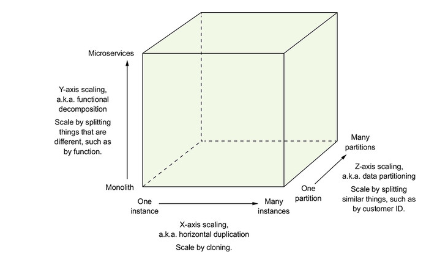

https://akfpartners.com/growth-blog/scale-cube

X軸: 水平擴展（Horizontal Scaling），將服務或數據複製多份

Y軸: 根據功能或業務來對應用進行拆分(微服務)

Z軸: 根據客戶或地理進行Sharding分區

## 基本架構

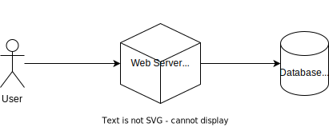

## 前後端分離架構

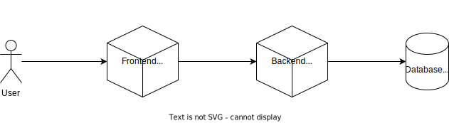

## 服務分離架構

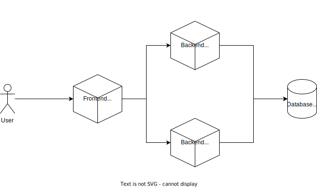

## 負載平衡

有狀態（stateful）-> 無狀態（stateless）

水平擴展（Horizontal Scaling）

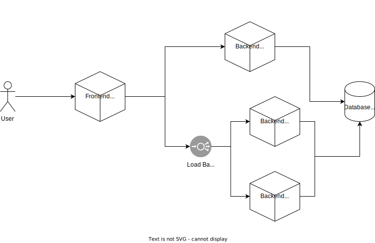

## 資料庫複寫(Database Replication)與讀寫分離

水平擴展（Horizontal Scaling）

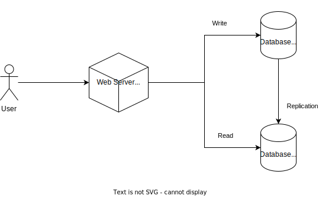

## 快取（Cache）

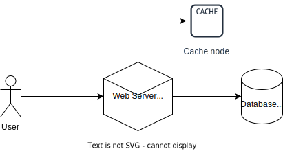

## 內容傳遞網路（Content Delivery Network, CDN）

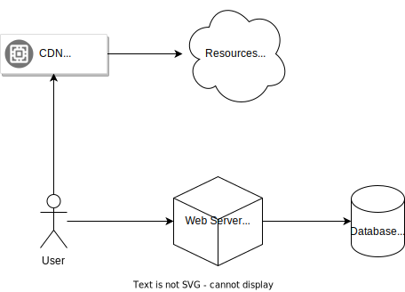

## 訊息佇列（Message Queue）

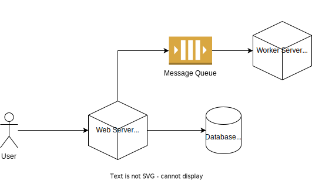

<!--

垂直擴展（Vertical Scaling）

水平擴展（Horizontal Scaling）

-->

## DDD 架構

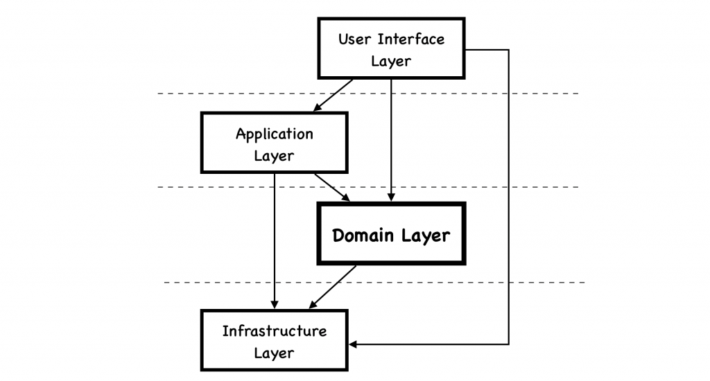

介面層Interface:
  - 負責向使用者顯示資訊和解釋使用者的指令。使用者可能是人也有可能是另一個系統。

應用層Application:	
  - 定義軟體要完成的任務(使用案例)，並指揮 Domain 來實現業務邏輯的計算。

領域層Domain:	
  - 負責保管業務概念、業務狀態以及業務規則。本層式軟體的核心。

基礎層Infrastructure:	
  - 為上面個層提供技術能力：為 Application 傳遞訊息、為 Domain 提供持久化機制、為 User Interface 處理畫面等等。

## JWT

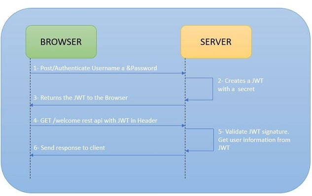

## SNAKE原则

SNAKE原则（Scenario, Necessary, Application, Kilobit, Evolve）

Scenario（場景）：用例/介面

Necessary（限制）：檢視需求/假設

Application（應用）：服務/演算法

Kilobit（資料）

Evolve（進化）

