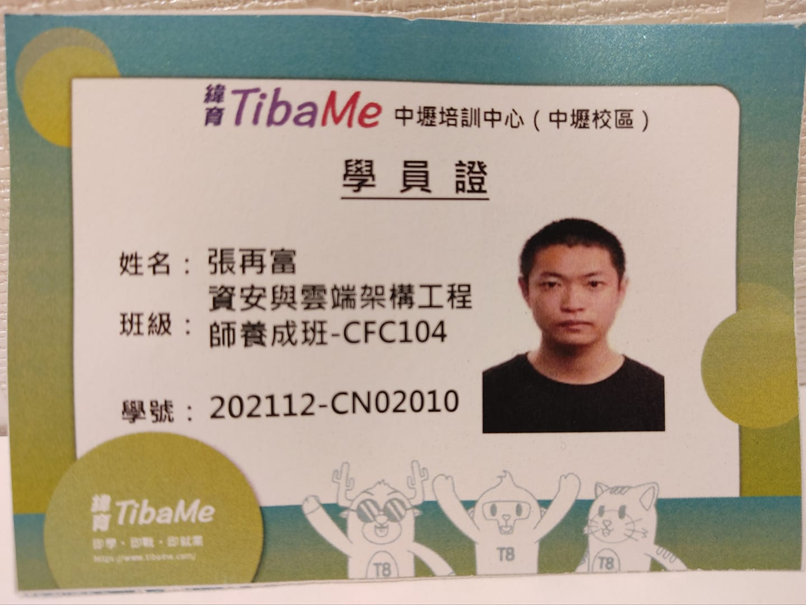
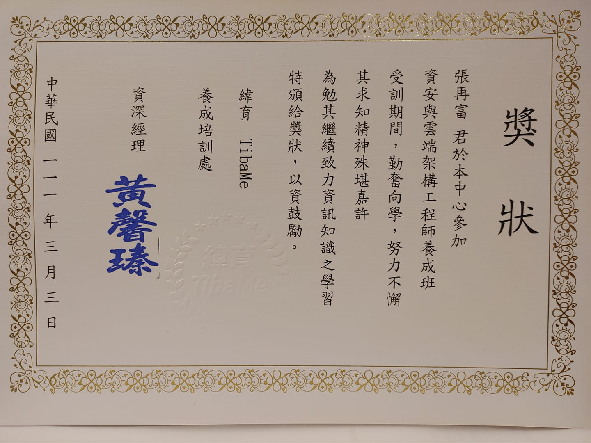
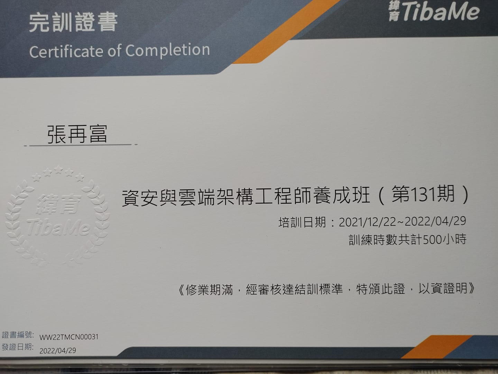
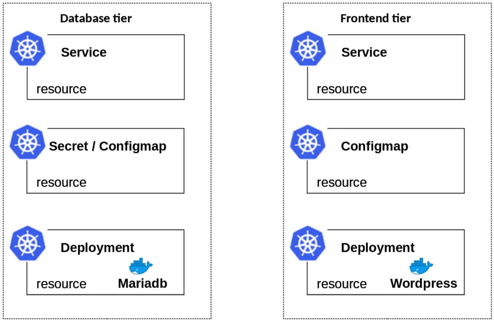
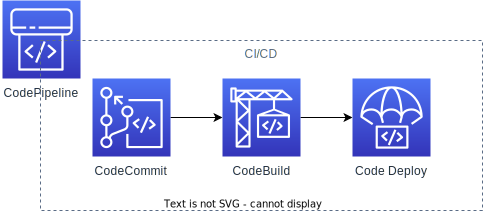
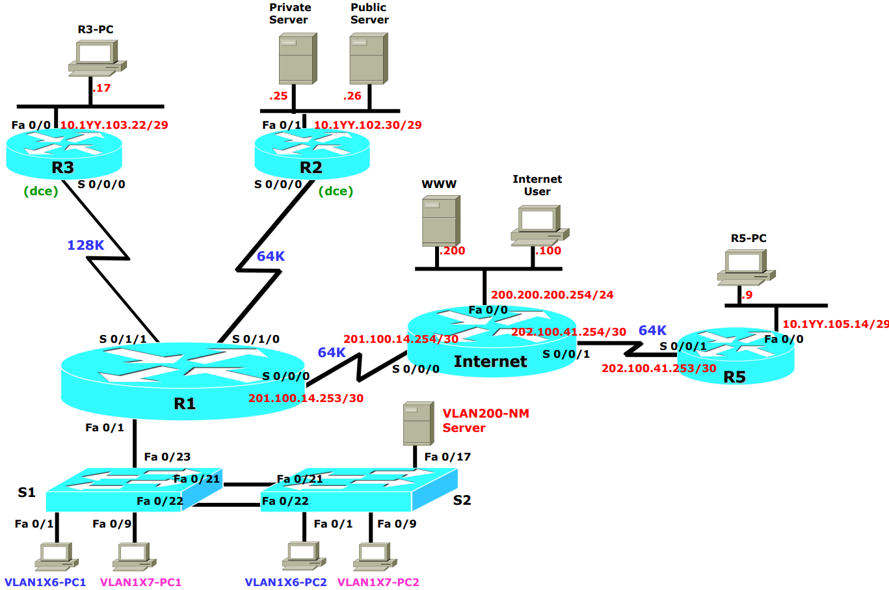
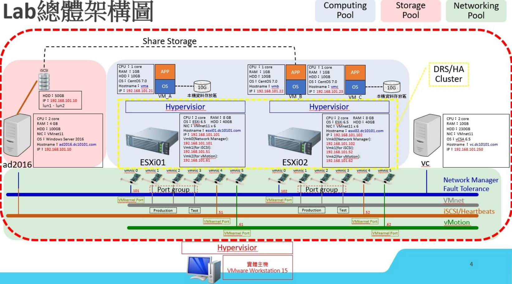
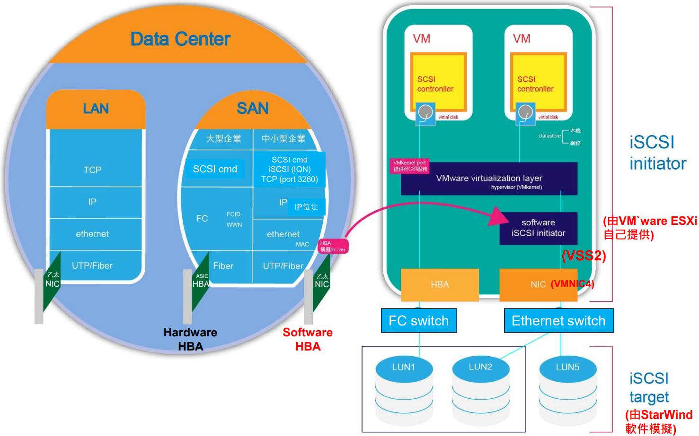
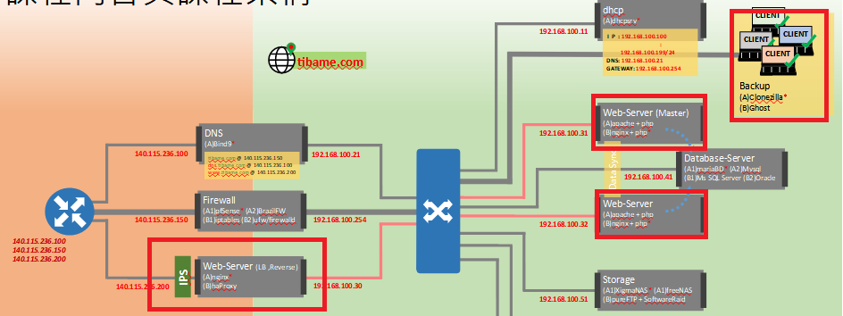

<!--
參考: https://github.com/CyC2018/Markdown-Resume

icon: https://www.svgrepo.com/

-->

# 張再富 (zack)
<!--
人生三十年，與天地長久相較，如夢又似幻；一度得生者，豈有不滅者乎？
-->

    擔任軟體工程師需要嚴謹的邏輯思考，並且能夠轉化於實際應用，相信貴公司所交付的任務，必能夠利用學經歷專長努力達成。

    個性隨和、友善，希望把事情做到完美，不斷的學習並且要求自己要做到最好，不懂的事務會主動詢問學習，期待不斷精進自己的專業知識，努力學習做好每一件事情，希望能夠獲得貴公司的面試機會。

---

## 資格綜述 - Summary of Qualifications
return [Summary](#summary)

- 5年以上的各種資訊公司或專案的開發和維護經驗。
- 熟悉物件導向、設計模式、應用程式架構開發…等。
- 遵循軟體工程規範: 單元測試、版本控管、整合測試…等。
- 可獨立或與團隊成員搭配合作。
- 有過 Agile / Scrum開發經驗
- 熟悉 Spring boot 框架
- 熟悉 Restful API 設計。
- 熟悉 RDBMS 關聯式系統設計。
- 熟悉 NoSQL 資料庫系統設計。
- 了解 Microservices 微服務概念。
- 有基本 Html、JavaScript 能力。
- 了解 Git & SVN 原理及使用。
- 了解 Docker 和 K8s 操作。
- 了解 AWS / GCP 公有雲架構。

---

## 聯絡方式 - Contact Information
return [Summary](#summary)

-  聯絡方式-Contact Information
  -  Line: zeroxzack</a>
  -  Email: rockexe0000@yahoo.com.tw
  -  Phone: 0912344343

---

## 個人資訊 - Personal Information
return [Summary](#summary)

-  個人資訊-Personal Information
  - 求職意向：DEVOPS工程師、JAVA工程師
  - 工作經驗：5 年
  - 希望地點：台北市
  - 關於未來工作的提問: <https://github.com/rockexe0000/rockexe0000/blob/main/reverse-interview.md>
    > 
  -  Github: <https://github.com/rockexe0000>
    > 
 <!-- - 期望薪資：100k-->
---

## Summary
return [Summary](#summary)

<!-- TOC -->

- [張再富 zack](#%E5%BC%B5%E5%86%8D%E5%AF%8C-zack)
    - [資格綜述 - Summary of Qualifications](#%E8%B3%87%E6%A0%BC%E7%B6%9C%E8%BF%B0---summary-of-qualifications)
    - [聯絡方式 - Contact Information](#%E8%81%AF%E7%B5%A1%E6%96%B9%E5%BC%8F---contact-information)
    - [個人資訊 - Personal Information](#%E5%80%8B%E4%BA%BA%E8%B3%87%E8%A8%8A---personal-information)
    - [Summary](#summary)
    - [工作經歷 - Work Experience](#%E5%B7%A5%E4%BD%9C%E7%B6%93%E6%AD%B7---work-experience)
        - [緯育股份有限公司，進修，2021/12~2022/04](#%E7%B7%AF%E8%82%B2%E8%82%A1%E4%BB%BD%E6%9C%89%E9%99%90%E5%85%AC%E5%8F%B8%E9%80%B2%E4%BF%AE202112202204)
        - [云智資訊股份有限公司，JAVA工程師，2021/04~2021/10](#%E4%BA%91%E6%99%BA%E8%B3%87%E8%A8%8A%E8%82%A1%E4%BB%BD%E6%9C%89%E9%99%90%E5%85%AC%E5%8F%B8java%E5%B7%A5%E7%A8%8B%E5%B8%AB202104202110)
        - [正璽顧問有限公司，JAVA工程師，2018/11~2021/01](#%E6%AD%A3%E7%92%BD%E9%A1%A7%E5%95%8F%E6%9C%89%E9%99%90%E5%85%AC%E5%8F%B8java%E5%B7%A5%E7%A8%8B%E5%B8%AB201811202101)
        - [中華系統整合，JAVA工程師，2016/10~2018/08](#%E4%B8%AD%E8%8F%AF%E7%B3%BB%E7%B5%B1%E6%95%B4%E5%90%88java%E5%B7%A5%E7%A8%8B%E5%B8%AB201610201808)
    - [最高學歷 - Education](#%E6%9C%80%E9%AB%98%E5%AD%B8%E6%AD%B7---education)
        - [大同大學Tatung University，資訊工程學系，2012/09~2016/09](#%E5%A4%A7%E5%90%8C%E5%A4%A7%E5%AD%B8tatung-university%E8%B3%87%E8%A8%8A%E5%B7%A5%E7%A8%8B%E5%AD%B8%E7%B3%BB201209201609)
    - [專案經歷 - Project Experience](#%E5%B0%88%E6%A1%88%E7%B6%93%E6%AD%B7---project-experience)
        - [緯育TibaMe - 專案](#%E7%B7%AF%E8%82%B2tibame---%E5%B0%88%E6%A1%88)
            - [專案名稱：雲端經典架構-WordPress 2021/12 ~ 2022/04 共5個月](#%E5%B0%88%E6%A1%88%E5%90%8D%E7%A8%B1%E9%9B%B2%E7%AB%AF%E7%B6%93%E5%85%B8%E6%9E%B6%E6%A7%8B-wordpress-202112--202204-%E5%85%B15%E5%80%8B%E6%9C%88)
            - [專案名稱：k8s 容器管理 2021/12 ~ 2022/04 共5個月](#%E5%B0%88%E6%A1%88%E5%90%8D%E7%A8%B1k8s-%E5%AE%B9%E5%99%A8%E7%AE%A1%E7%90%86-202112--202204-%E5%85%B15%E5%80%8B%E6%9C%88)
            - [專案名稱：AWS Devops經典流程的實作 2021/12 ~ 2022/04 共5個月](#%E5%B0%88%E6%A1%88%E5%90%8D%E7%A8%B1aws-devops%E7%B6%93%E5%85%B8%E6%B5%81%E7%A8%8B%E7%9A%84%E5%AF%A6%E4%BD%9C-202112--202204-%E5%85%B15%E5%80%8B%E6%9C%88)
            - [專案名稱：跨國企業網路規劃與實作 2021/12 ~ 2022/04 共5個月](#%E5%B0%88%E6%A1%88%E5%90%8D%E7%A8%B1%E8%B7%A8%E5%9C%8B%E4%BC%81%E6%A5%AD%E7%B6%B2%E8%B7%AF%E8%A6%8F%E5%8A%83%E8%88%87%E5%AF%A6%E4%BD%9C-202112--202204-%E5%85%B15%E5%80%8B%E6%9C%88)
            - [專案名稱：私有雲建置 2021/12 ~ 2022/04 共5個月](#%E5%B0%88%E6%A1%88%E5%90%8D%E7%A8%B1%E7%A7%81%E6%9C%89%E9%9B%B2%E5%BB%BA%E7%BD%AE-202112--202204-%E5%85%B15%E5%80%8B%E6%9C%88)
            - [專案名稱：HAProxy建置 2021/12 ~ 2022/04 共5個月](#%E5%B0%88%E6%A1%88%E5%90%8D%E7%A8%B1haproxy%E5%BB%BA%E7%BD%AE-202112--202204-%E5%85%B15%E5%80%8B%E6%9C%88)
        - [國泰金控 - 專案](#%E5%9C%8B%E6%B3%B0%E9%87%91%E6%8E%A7---%E5%B0%88%E6%A1%88)
            - [專案名稱：投資平台-多租戶會員 2021/04 ~ 2021/10 共7個月](#%E5%B0%88%E6%A1%88%E5%90%8D%E7%A8%B1%E6%8A%95%E8%B3%87%E5%B9%B3%E5%8F%B0-%E5%A4%9A%E7%A7%9F%E6%88%B6%E6%9C%83%E5%93%A1-202104--202110-%E5%85%B17%E5%80%8B%E6%9C%88)
            - [專案名稱：智慧醫療 業務中台 2021/04 ~ 2021/10 共7個月](#%E5%B0%88%E6%A1%88%E5%90%8D%E7%A8%B1%E6%99%BA%E6%85%A7%E9%86%AB%E7%99%82-%E6%A5%AD%E5%8B%99%E4%B8%AD%E5%8F%B0-202104--202110-%E5%85%B17%E5%80%8B%E6%9C%88)
        - [中國人壽 - 專案](#%E4%B8%AD%E5%9C%8B%E4%BA%BA%E5%A3%BD---%E5%B0%88%E6%A1%88)
            - [專案名稱：數位行銷部-電子商務前台 2020/01 ~ 2021/01 共13個月](#%E5%B0%88%E6%A1%88%E5%90%8D%E7%A8%B1%E6%95%B8%E4%BD%8D%E8%A1%8C%E9%8A%B7%E9%83%A8-%E9%9B%BB%E5%AD%90%E5%95%86%E5%8B%99%E5%89%8D%E5%8F%B0-202001--202101-%E5%85%B113%E5%80%8B%E6%9C%88)
            - [專案名稱：數位行銷部-電子商務後台 2020/01 ~ 2021/01 共13個月](#%E5%B0%88%E6%A1%88%E5%90%8D%E7%A8%B1%E6%95%B8%E4%BD%8D%E8%A1%8C%E9%8A%B7%E9%83%A8-%E9%9B%BB%E5%AD%90%E5%95%86%E5%8B%99%E5%BE%8C%E5%8F%B0-202001--202101-%E5%85%B113%E5%80%8B%E6%9C%88)
        - [宏碁 - 專案](#%E5%AE%8F%E7%A2%81---%E5%B0%88%E6%A1%88)
            - [專案名稱：最高法院相關系統開發及維護 2018/11 ~ 2019/12 共13個月](#%E5%B0%88%E6%A1%88%E5%90%8D%E7%A8%B1%E6%9C%80%E9%AB%98%E6%B3%95%E9%99%A2%E7%9B%B8%E9%97%9C%E7%B3%BB%E7%B5%B1%E9%96%8B%E7%99%BC%E5%8F%8A%E7%B6%AD%E8%AD%B7-201811--201912-%E5%85%B113%E5%80%8B%E6%9C%88)
            - [專案名稱：最高法院轉檔系統維護 2018/11 ~ 2019/12 共13個月](#%E5%B0%88%E6%A1%88%E5%90%8D%E7%A8%B1%E6%9C%80%E9%AB%98%E6%B3%95%E9%99%A2%E8%BD%89%E6%AA%94%E7%B3%BB%E7%B5%B1%E7%B6%AD%E8%AD%B7-201811--201912-%E5%85%B113%E5%80%8B%E6%9C%88)
        - [中華電信研究院 - 專案](#%E4%B8%AD%E8%8F%AF%E9%9B%BB%E4%BF%A1%E7%A0%94%E7%A9%B6%E9%99%A2---%E5%B0%88%E6%A1%88)
            - [專案名稱：帳務系統出帳作業 2016/10 ~ 2018/08 共22個月](#%E5%B0%88%E6%A1%88%E5%90%8D%E7%A8%B1%E5%B8%B3%E5%8B%99%E7%B3%BB%E7%B5%B1%E5%87%BA%E5%B8%B3%E4%BD%9C%E6%A5%AD-201610--201808-%E5%85%B122%E5%80%8B%E6%9C%88)
            - [專案名稱：出帳作業抽產檔模組 2016/10 ~ 2018/08 共22個月](#%E5%B0%88%E6%A1%88%E5%90%8D%E7%A8%B1%E5%87%BA%E5%B8%B3%E4%BD%9C%E6%A5%AD%E6%8A%BD%E7%94%A2%E6%AA%94%E6%A8%A1%E7%B5%84-201610--201808-%E5%85%B122%E5%80%8B%E6%9C%88)
            - [專案名稱：帳務排程系統維護 2016/10 ~ 2018/08 共22個月](#%E5%B0%88%E6%A1%88%E5%90%8D%E7%A8%B1%E5%B8%B3%E5%8B%99%E6%8E%92%E7%A8%8B%E7%B3%BB%E7%B5%B1%E7%B6%AD%E8%AD%B7-201610--201808-%E5%85%B122%E5%80%8B%E6%9C%88)
            - [專案名稱：帳務系統持續性整合 2016/10 ~ 2018/08 共22個月](#%E5%B0%88%E6%A1%88%E5%90%8D%E7%A8%B1%E5%B8%B3%E5%8B%99%E7%B3%BB%E7%B5%B1%E6%8C%81%E7%BA%8C%E6%80%A7%E6%95%B4%E5%90%88-201610--201808-%E5%85%B122%E5%80%8B%E6%9C%88)
    - [技能清單 - Skills](#%E6%8A%80%E8%83%BD%E6%B8%85%E5%96%AE---skills)
    - [自傳 - Autobiography](#%E8%87%AA%E5%82%B3---autobiography)
        - [開頭](#%E9%96%8B%E9%A0%AD)
        - [家庭背景](#%E5%AE%B6%E5%BA%AD%E8%83%8C%E6%99%AF)
        - [大同大學 - 經歷](#%E5%A4%A7%E5%90%8C%E5%A4%A7%E5%AD%B8---%E7%B6%93%E6%AD%B7)
        - [中華電信研究院 - 經歷](#%E4%B8%AD%E8%8F%AF%E9%9B%BB%E4%BF%A1%E7%A0%94%E7%A9%B6%E9%99%A2---%E7%B6%93%E6%AD%B7)
        - [宏碁 - 經歷](#%E5%AE%8F%E7%A2%81---%E7%B6%93%E6%AD%B7)
        - [中國人壽 - 經歷](#%E4%B8%AD%E5%9C%8B%E4%BA%BA%E5%A3%BD---%E7%B6%93%E6%AD%B7)
        - [國泰金控 - 經歷](#%E5%9C%8B%E6%B3%B0%E9%87%91%E6%8E%A7---%E7%B6%93%E6%AD%B7)
        - [緯育TibaMe - 經歷](#%E7%B7%AF%E8%82%B2tibame---%E7%B6%93%E6%AD%B7)
        - [職涯及學習 - 規劃](#%E8%81%B7%E6%B6%AF%E5%8F%8A%E5%AD%B8%E7%BF%92---%E8%A6%8F%E5%8A%83)
        - [結尾](#%E7%B5%90%E5%B0%BE)
        - [附註](#%E9%99%84%E8%A8%BB)

<!-- /TOC -->

---

## 工作經歷 - Work Experience
return [Summary](#summary)

 工作經歷-Work Experience

### 緯育股份有限公司，進修，2021/12~2022/04
<!--

-->

### 云智資訊股份有限公司，JAVA工程師，2021/04~2021/10

### 正璽顧問有限公司，JAVA工程師，2018/11~2021/01

### 中華系統整合，JAVA工程師，2016/10~2018/08

---

## 最高學歷 - Education
return [Summary](#summary)

 最高學歷 – Education

### 大同大學(Tatung University)，資訊工程學系，2012/09~2016/09
<!---->

---

## 專案經歷 - Project Experience
return [Summary](#summary)

 專案經歷-Project Experience

### 緯育TibaMe - 專案
return [Summary](#summary)

#### 專案名稱：雲端經典架構-WordPress (2021/12 ~ 2022/04 共5個月)
return [Summary](#summary)

  - 專案內容：
    - 在AWS/GCP搭建一個Wordpress網站
  - 工作內容：
    - 本地端用 Docker Container 啟動 wordpress
    - 配置 AWS VPC
    - wordpress 移至 AWS VPC
    - mysql 移至 AWS RDS
    - 用GoDaddy申請網域並設置DNS管理
    - 用nginx反向代理，取得SSL憑證並對網站加密
    - wordpress多媒體檔案移至 AWS S3
    - 用SSM統一管理主機
  - 專案系統環境：
    - AWS, GCP
  - 使用技術：
    - IAM, VPC, SSL, mysql
  - 使用工具：
    - docker, wordpress, nginx, git, AWS SSM
  - 相關連結
    - <https://github.com/rockexe0000/cfc104_project1>
      > 
    - <https://zeroxzack.xyz/>
      > 

#### 專案名稱：k8s 容器管理 (2021/12 ~ 2022/04 共5個月)
return [Summary](#summary)

  - 專案內容：
    - k8s 架設WordPress部落格
  - 工作內容：
    - 建置MySQL
      - 建⽴密碼檔及環境變數供Pod(MySQL)使⽤
      - Pod(MySQL)資料落地
      - 為Pod(MySQL)建⽴服務為WordPress連接準備
    - 建⽴WordPress
      - 建⽴環境變數供Pod(WordPress)使⽤
      - 設定WordPress連接MySQL資料庫
      - Pod(WordPress)資料落地
      - 建⽴WordPress服務
      - 開啟WordPress⾸⾴並開始進⾏部落格設定
    - 備份資源物件與還原
  - 專案系統環境：
    - VMware, CentOS7
  - 使用技術：
    - k8s, docker
  - 使用工具：
    - wordpress, mysql

#### 專案名稱：AWS Devops經典流程的實作 (2021/12 ~ 2022/04 共5個月)
return [Summary](#summary)

  - 專案內容：
    - 使用Git、Docker、Code Commit、Code Build、Code Deploy
  - 工作內容：
    - Code Commit
      - 建立repository
      - 添加Code Commit repository url 進入本地git資料夾
      - 將本地分支推上雲端
      - 連入EC2，將Code Commit 源碼拉入至ec2
      - 當程式碼有新更動的時候
        - 開發人員
          - 程式碼 → Code Commit
        - 系統維運人員
          - 連入ec2 → 把新版源碼拉下來 → 停止container → 刪除image → 用新源碼構建image → 製作container
    - Code build
      - 創建ECR(Elastic Container Service)
      - 修改buildspec.yml
        - 設定secrect Manager的變數
        - 設定ECR倉庫的位置
      - 修改build.sh
      - 將本地更新過的檔案，推入Code Commit
      - 創建Code Build專案
        - 選擇buildspec檔案的來源及位置
        - 去IAM修改Role的policy增加AmazonEC2ContainerRegistryFullAccess、AmazonEC2ContainerRegistryPowerUser
        - 開始Build
        - 連入EC2並登入ECR，就可從EC2抓取ECR上的Image
        - 啟用容器服務
    - Code Deploy
      - 修改appspec.yml及四個腳本的檔案內容
        - 修改ApplicationStop.sh檔案的容器名稱
        - 修改BeforeInstall.sh檔案的ECR image來源名稱
        - 修改ApplicationStart.sh檔案Port位及ECR image來源
        - 修改ValidateService.sh檔案的Port為80
      - 打包檔案後上傳至AWS S3
      - 創建Code deploy
  - 專案系統環境：
    - VMware, CentOS7, AWS
  - 使用技術：
    - docker, git
  - 使用工具：
    - AWS Code Commit, AWS Code build, AWS Code Deploy

#### 專案名稱：跨國企業網路規劃與實作 (2021/12 ~ 2022/04 共5個月)
return [Summary](#summary)

  - 專案內容：
    - VLSM切割子網段與IP位址的指定
    - VLAN/802.1QTrunking/Inter-VLAN Routering
    - Multiple Area OSPF / Static / Default Routing設定與優化
    - Static NAT / Dynamic NAT / PAT 設定
    - ACL / Firewall DMZ 的 Security 設定
    - IPSec Site-to-Site VPN 設定
  - 專案系統環境：
    - Windows
  - 使用技術：
    - TCP/IP
  - 使用工具：
    - Cisco PacketTracer

#### 專案名稱：私有雲建置 (2021/12 ~ 2022/04 共5個月)
return [Summary](#summary)

  - 專案內容：
    - 雲端作業系統建置與維護
  - 工作內容：
    - 安裝 Windows Server 2008 R2
    - 建置 Active Directory Domain Service (AD DS) 與 DNS
    - ESXi 安裝與設定
    - 安裝 vCenter Server
    - 建置 Shared Storage(共享儲存資源)
    - vMotion/DRS線上遷移與實體資源負載平衡
    - 設置 HA(High Availability)，備援架設
    - 設置 FT(Fault Tolerance)，使系統在部分組件發生故障時仍能正常運作
  - 專案系統環境：
    - Windows, VMware
  - 使用技術：
    - TCP/IP
  - 使用工具：
    - VMware vSphere Client
  - 相關連結
    - <https://cfc104vmware.netlify.app/>
      > 

#### 專案名稱：HAProxy建置 (2021/12 ~ 2022/04 共5個月)
return [Summary](#summary)

  - 專案內容：
    - 平衡負載、容錯機制的建置
  - 工作內容：
    - 使用 HAProxy (web0)建置 HTTP 的平衡負載、容錯機制
  - 專案系統環境：
    - ubuntu 20.04, frontend-webserver, backend-webserver
  - 使用技術：
    - TCP/IP, load balance
  - 使用工具：
    - HAProxy, jmeter
  - 相關連結
    - <https://github.com/rockexe0000/HAProxy>
      > 

---

### 國泰金控 - 專案
return [Summary](#summary)

#### 專案名稱：投資平台-多租戶會員 (2021/04 ~ 2021/10 共7個月)
return [Summary](#summary)

  - 專案內容：
    - 投資平台多租戶架構會員服務
  - 工作內容：
    - 租戶管理、會員管理等相關功能的開發
  - 專案系統環境：
    - GCP, PostgreSQL
  - 使用技術：
    - JAVA, Spring, Docker, JWT, OpenAPI, google identity platform, RESTful API, Microservices
  - 使用工具：
    - Eclipse, Gradle, Git, DataGrip, nginx

#### 專案名稱：智慧醫療 業務中台 (2021/04 ~ 2021/10 共7個月)
return [Summary](#summary)

  - 專案內容：
    - 串接數據後台API、問卷API
  - 工作內容：
    - 帳號註冊、資料變更、欄位檢核、查詢提交問卷、會員綁定解除綁定等相關功能的開發
  - 專案系統環境：
    - AWS, PostgreSQL, MongoDB
  - 使用技術：
    - JAVA, Spring, Docker, JWT, OpenAPI, RESTful API, Microservices
  - 使用工具：
    - Eclipse, Gradle, Git, DataGrip, aws cognito

---

### 中國人壽 - 專案
return [Summary](#summary)

#### 專案名稱：數位行銷部-電子商務前台 (2020/01 ~ 2021/01 共13個月)
return [Summary](#summary)

  - 專案內容：
    - 電子商務前台-提供客戶線上投保相關的服務
  - 工作內容：
    - 帳號註冊、資料變更、欄位檢核、線上投保、保費試算、電子保單下載、電文發送、電文接收、表單套印、批次作業等相關功能的開發及維護
  - 專案系統環境：
    - Linux、Windows、oracle
  - 使用技術：
    - JAVA, jQuery, JavaScript, CSS3, JSP/Servlet, HTML, Spring, stripes, mybatis, AJAX, ESB, bootstrap, jasper, ireport, quartz
  - 使用工具：
    - eclipse, gradle, subversion, sql developer

#### 專案名稱：數位行銷部-電子商務後台 (2020/01 ~ 2021/01 共13個月)
return [Summary](#summary)

  - 專案內容：
    - 電子商務後台-提供內部人員維護投保相關的服務
  - 工作內容：
    - 帳號註冊、資料變更、欄位檢核、監控報表查詢等相關功能的開發及維護
  - 專案系統環境：
    - Linux, Windows, oracle
  - 使用技術：
    - JAVA, jQuery, JavaScript, CSS3, JSP/Servlet, HTML, Spring, stripes, mybatis, AJAX, ESB, bootstrap
  - 使用工具：
    - eclipse, gradle, subversion, sql developer

---

### 宏碁 - 專案
return [Summary](#summary)

#### 專案名稱：最高法院相關系統開發及維護 (2018/11 ~ 2019/12 共13個月)
return [Summary](#summary)

  - 專案內容：
    - 最高法院相關系統開發及維護
  - 工作內容：
    - 分案、卷面、例稿、報表、警示、繳費、卷庫...等系統開發及維護
  - 專案系統環境：
    - Linux, Windows, oracle
  - 使用技術：
    - JAVA, jQuery, JavaScript, CSS3, JSP/Servlet, HTML
  - 使用工具：
    - eclipse, subversion

#### 專案名稱：最高法院轉檔系統維護 (2018/11 ~ 2019/12 共13個月)
return [Summary](#summary)

- 專案內容：
  - 最高法院轉檔系統維護
- 工作內容：
  - 打包最高資料給其他單位或接收其他單位資料的批次系統開發及維護
- 專案系統環境：
  - Windows, oracle
- 使用技術：
  - JAVA
- 使用工具：
  - eclipse, subversion

---

### 中華電信研究院 - 專案
return [Summary](#summary)

#### 專案名稱：帳務系統出帳作業 (2016/10 ~ 2018/08 共22個月)
return [Summary](#summary)

  - 專案內容：
    - 根據分析人員開出的需求文件，確認規格及流程，產出作業程式
  - 工作內容：
    - shell，service層及DAO層，sql效能優化，單元測試，使用手冊
  - 專案系統環境：
    - Linux, AIX, informix
  - 使用技術：
    - java, spring, hibernate, jpa, junit, shell Script
  - 使用工具：
    - eclipse, maven, subversion, dbvisualizer, filezilla

#### 專案名稱：出帳作業抽產檔模組 (2016/10 ~ 2018/08 共22個月)
return [Summary](#summary)

  - 專案內容：
    - 根據設定檔抽取資料，產製指定格式檔案的模組
  - 工作內容：
    - 制定設定檔參數、執行參數、執行流程，多執行緒設計，單元測試，使用手冊
  - 專案系統環境：
    - Linux, AIX, informix
  - 使用技術：
    - java, spring, hibernate, jpa, junit
  - 使用工具：
    - eclipse, maven, subversion, dbvisualizer, filezilla

#### 專案名稱：帳務排程系統維護 (2016/10 ~ 2018/08 共22個月)
return [Summary](#summary)

  - 專案內容：
    - 帳務排程系統維護
  - 工作內容：
    - 網站及後台的開發及維護
  - 專案系統環境：
    - Linux, AIX, informix
  - 使用技術：
    - java, spring, hibernate, jpa, servlet, jsp, jboss, struts
  - 使用工具：
    - eclipse, maven, subversion, dbvisualizer, filezilla, Quartz

#### 專案名稱：帳務系統持續性整合 (2016/10 ~ 2018/08 共22個月)
return [Summary](#summary)

  - 專案內容：
    - 帳務系統持續性整合
  - 工作內容：
    - 建立環境可自動化建置,測試及分析
  - 專案系統環境：
    - Linux
  - 使用技術：
    - java
  - 使用工具：
    - eclipse, maven, subversion, Jenkins, sonarqube

---

## 技能清單 - Skills
return [Summary](#summary)

 技能清單-Skills

(1.有自行學習, 2.非主要或不常用, 3.有實務經驗, 4.有多次實務經驗, 5.精通)

**Back-end & Frameworks**
> 主要是用JAVA開發Web後端，也有開發批次或排程等其它部分，Spring框架有用到控制反轉 (Inversion of Control，IoC) 的機制做依賴注入(Dependency Injection，DI)，透過剖面導向程式設計(Aspect-Oriented Programming，AOP)的方式做執行時間的記錄

- Java ★★★★☆
- Spring ★★★★☆

**Front-end & Frameworks**
> 可以透過瀏覽器的開發者工具，對前端的功能追蹤或調整

- JavaScript ★★☆☆☆
- jquery ★★☆☆☆
- bootstrap ★★☆☆☆
- html ★★☆☆☆
- css ★★☆☆☆

**Databases**
> 使用上主要是以後端程式操作資料庫為主，通常是用物件關聯對映(Object Relational Mapping，ORM)或是客製化SQL存取 
> SQL優化的部分通常是回應時間過慢才會去調整，方法大致上有 table partitioning、sql explain、temp table、SQL分割或重構等

- PostgreSQL★★☆☆☆
- mysql ★★☆☆☆
- oracle ★★☆☆☆
- informix ★★☆☆☆
- mongoDB ★☆☆☆☆

**Servers**

- nginx ★★☆☆☆
- tomcat ★★☆☆☆

**Operating System**
> 基本指令系統操作，通常是把指令包成shell去執行

- windows ★★★☆☆
- linux ★★★☆☆

**Build Tool**
> 通常專案用maven/gradle建構和管理第三方程式庫依賴，docker把專案容器化

- maven ★★★☆☆
- gradle ★★★☆☆
- docker ★★★☆☆

**Continuous Integration**
> jenkins用在開發區程式送出後，自動建置並執行單元測試，建置失敗或單元測試有錯會發送通知

- jenkins ★☆☆☆☆

**Version Control System**
> 主要有 master 和 release 這兩條分支，master是目前開發的分支，release是準備要交付的分支

- git ★★★☆☆
- SVN ★★★☆☆

---

## 自傳 - Autobiography
return [Summary](#summary)

 自傳-Autobiography

### 開頭
return [Summary](#summary)

    擔任軟體工程師需要嚴謹的邏輯思考，並且能夠轉化於實際應用，相信貴公司所交付的任務，必能夠利用學經歷專長努力達成。 

### 家庭背景
return [Summary](#summary)

    從小生長在台北，家中有6個成員，從小對於科技非常有興趣，父母開明的教育方式，讓我對於新鮮事物都會去了解，並且研究追根根到底。在學期間也學習如何與人溝通和協調與人合作，團隊的管理與組織的能力，永遠要讓自己在一個積極的態度，來面對未知的挑戰。 

### 大同大學 - 經歷
return [Summary](#summary)

    本人畢業於大同大學資訊工程系，系內的教學目標以「電腦基礎理論」與「應用技術」為主軸，並且著重「獨立思考」的研究能力，目標是成為資訊業核心技術人才。在學期間參加許多次大學程式能力檢定(Collegiate Programming Examination，CPE)，除了課堂知識，希望能讓新資訊與社會同步接軌，因應未來職場的需要。
 
    大學畢業專題內容是演算法平行化，方法大致上是先將原本以循序執行的演算法做分析，將可同時運算的部份取出，透過 NVIDIA 所推出的統一計算架構(Compute Unified Device Architecture，CUDA)技術利用繪圖處理單元(Graphics Processing Unit，GPU)同時出理多重任務。

### 中華電信研究院 - 經歷
return [Summary](#summary)

    畢業後於中華電信研究院工作，協助開發帳務系統，過程中熟悉了一些開發框架或技術，例如:spring、maven、junit、svn等，工作內容主要是根據分析文件開發出相對應的作業程式，有時會幫忙開發維護工具。

    帳務系統出帳作業的部份，主要是跟據分析文件開發出對應的出帳作業，JAVA 使用的 framework 是 spring，透過控制反轉 (Inversion of Control，IoC) 的機制做依賴注入(Dependency Injection，DI)，透過剖面導向程式設計(Aspect-Oriented Programming，AOP)的方式做執行時間的記錄。

    程式架構分成 coordinator、service 和 dao 三層，coordinator 層是程式接口，做跨元件的流程與資訊串聯，service 層是業務邏輯，分成component、module 和 parts，component 已定義的元件功能，module 可組合成元件功能的模組，parts 資料結構與資料處理邏輯，dao 層是負責資料存取，用到的 orm 技術是 Hibernate，會透過jpa去做資料的存取，一部份是直接用 SQL 透過 jdbc 修改資料，交易處理則是用 spring 的 JTA，主要是在發生exception 可以將資料 rollback。

    出帳作業抽產檔模組的部份，會跟據設定檔將資料以指定的格式輸出成檔案，設定檔會有 thread數、格式檔路徑、輸出路徑、資料取得邏輯、排序規則、排版類型、分格符號、額外處理設定，主要流程分成:取資料->額外處理->排版->寫檔，thread 數大於 1 時，會鎖定每個流程只會有一個 thread 在執行，thread 最多可以有 4 個在執行。

    帳務排程系統，是用 Quartz 在指定的時間去執行出帳作業，可以設定每個作業相對執行關係，這個部份我主要是負責維護。

    帳務系統持續性整合的部份，是透過 Jenkins 和他的插件，在 building 失敗時發出 mail 通知，我負責的部分是 Jenkins 上的插件設定，有 emma 的 coverage、findings、sonarqube，emma 的 coverage 是用來測單元測試的覆蓋率，findings 是用來檢查隱藏 BUG 的工具，sonarqube 是程式碼分析平台，會呈現目前為止程式碼品質趨勢。

    軟體開發流程主要是以瀑布模式為主，按照需求、分析、設計、開發、測試、上線、維護的順序，碰到問題時就退回前一步確認，如果過程中有需求變更就會變成螺旋模式，在測試階段回到分析。

    分析文件會登入 trac，程式碼文件用 javadoc，trac 是類似維基百科的工具，分析文件的每次變更都記錄起來，後續維護會比較方便，javadoc 則是將程式碼中的註釋產生獨立的 API 文件，讓維護人員大概知道每個 method 的作用，設計文件有用 UML，有畫過 class diagram 和 sequence diagram。

### 宏碁 - 經歷
return [Summary](#summary)

    隨後於宏碁工作，協助最高法案開發維護分案系統，過程中了解在需求管理及功能管理的環境還不完整的情況下，必須做開發順序的優先度確認及開發功能前後上的差異才能開始開發。主要是用角色權限加上 Menu 的方式控制，法官、書記、審查等身分執行的功能，處理民事及刑事案件，web 是用 struts，資料庫是直接用SQL透過jdbc修改資料，版本控制是用svn，開發管理是用 BugTracker。

### 中國人壽 - 經歷
return [Summary](#summary)

    之後於中國人壽工作，協助開發線上投保電商前後台，電商前台是提供使用者網路投保及相關服務，電商後台是給內部人員代理使用者操作或是資料維護。

    過程中了解他們系統與系統之間，主要是服務導向架構(Service-Oriented Architecture，SOA)，用企業服務匯流排(Enterprise Service Bus，ESB)以協定好的JSON格式依據需求去轉換和傳遞，送出指定的資料格式，或是取得其他系統回覆的結果，網站優化有用 ehcache 把記憶體和磁碟儲存當作快取。

    軟體架構分成 actionBean、service 和 dao 三層，actionBean 是業務邏輯層，處理前端帶進來的參數；service 服務層，用來處理特定的邏輯；dao 層是負責資料存取，直接用 SQL 透過 mybatis 取得資料，專案建構是用gradle，web是用stripes，framework是用spring，orm是用mybatis。

### 國泰金控 - 經歷
return [Summary](#summary)

    之後於國泰金控工作，專案管理方式是用敏捷式(Scrum)，微服務(Microservices)架構，領域驅動開發(Domain Drive Design，DDD)，協助開發兩個專案。
 
    其中一個是智慧醫療業務中台系統，主要是利用問券的方式調查會員健康資訊後給予建議，提供RESTful API給地端呼叫，並用AWS cognito服務以JWT(JSON Web Token)做身分驗證，將轉換過的資料轉送至數據中心以方便資料分析及應用，同時用到 PostgreSQL 和 MongoDB 兩種資料庫儲存不同結構的資料，PostgreSQL存會員相關資料，MongoDB存問卷相關資料。
 
    另一個是多租戶(Multi-tenancy)架構的投資平台，是Serverless架構，主要是用到Google身分平台(Google Identity Platform，GIP)管理及驗證身分，租戶的客戶資料是以每個租戶一個獨立資料庫儲存，並以Hibernate中配置多租戶方式使用，服務架構分成 Gateway-service 和 Component-service 兩層，外部請求統一由 Nginx 導進 Gateway-service，Gateway-service 會再根據條件呼叫 Component-service。

### 緯育TibaMe - 經歷
return [Summary](#summary)

    之後於緯育TibaMe進修，是因為對於平常開發內容之外的基礎設施(infrastructure)想進一步了解，剛好商研院申請通過勞動部計畫，委託緯育TibaMe提供訓練課程，所以決定參加受訓，進修過程中補足了我一些除了開發之外的基本知識，像是網路、系統、虛擬化、Devops、雲端等，最後小組專題是將WordPress網站以經典架構佈署在AWS/GCP公有雲上。

    網路: 網路協定、網路規劃、基礎網路架構
    系統: LINUX環境建置與指令操作、權限管理、Shell Script、資訊安全
    虛擬化: VMware VSphere, ESXI, VCenter, VMotion, HA/FT
    Devops: Git, Docker, k8s, Ansible, CI/CD
    雲端: AWS/GCP 雲端服務, 環境配置, 資源監控

### 職涯及學習 - 規劃
return [Summary](#summary)

    之前工作主要是用JAVA開發Web後端，雖然可以繼續往這個方向專精，但是我希望可以往多元方向發展，不是只能專注在應用程式功能，可以將視野放寬到整體的宏觀架構。

    實現自我成長的方式主要是以專案用到部份去研究，假如專案原本就有在使用，剛好就可以了解實際使用的方式，如果要導入的話，可以根據後續使用的情況做調整，獲得相關的反饋。另一個方法是平常把有興趣了解的技術文章、影片做追蹤和保留，有空可以自行練習。

### 結尾
return [Summary](#summary)

    個性隨和、友善，希望把事情做到完美，不斷的學習並且要求自己要做到最好，不懂的事務會主動詢問學習，期待不斷精進自己的專業知識，努力學習做好每一件事情，希望能夠獲得貴公司的面試機會。

### 附註
return [Summary](#summary)

    P.S. 以上都是結束後依靠印象寫出來的，對我自己過去的復盤和紀錄，盡量列出比較主要的部份，僅供參考。

---

<!--

    <h3 align="left">Back-end & Frameworks</h3>
    
    
      
    <h3 align="left">Front-end & Frameworks</h3>
     
    
    
      
    
      
    <h3 align="left">Databases</h3>
     
    
      
    <h3 align="left">Servers</h3>
    
      
    <h3 align="left">Operating System</h3>
    
    
      
    <h3 align="left">Build Tool</h3>
    
    
      
    <h3 align="left">Continuous Integration</h3>
    
      
    <h3 align="left">Version Control System</h3>
    
      
     
    
     
     
     

- ★★★☆☆ Java
- ★★★☆☆ Spring
- ★☆☆☆☆ C++、Python
- ★★★☆☆ MySQL
- ★★☆☆☆ JavaScript
-->

